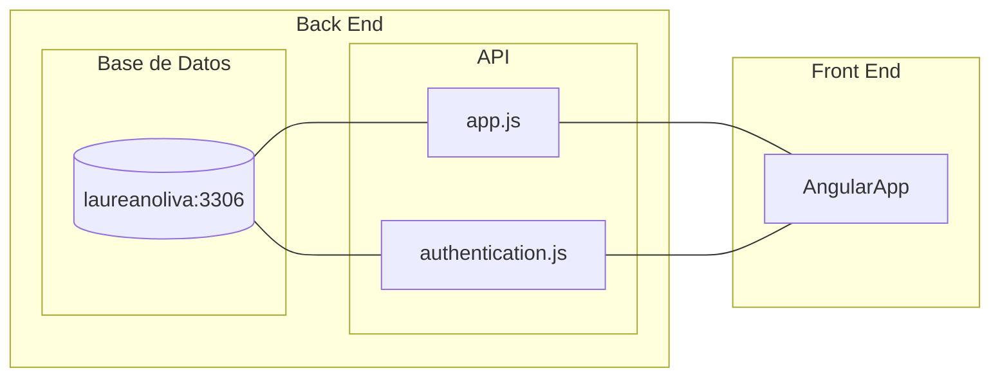

## Cosas Utiles
[TRELLO](https://trello.com/b/RQfTdn2D/tpdesarollodesoftware)

[FRONT END REPO](https://github.com/laucha54321/pagina-Universitaria-Front)

[BACK END REPO](https://github.com/laucha54321/tp-mysql-be)

# TP Desarollo BackEnd

Esta es una api que interactua con una base de datos SQL en laureanoliva.com:3306.

# Estructura
La idea es tener dos programas distintos en distintos puertos uno que se encargue de la validacion y otro que se encargue de los requests. Manejar las validaciones con [JSON web tokens](https://jwt.io) puede ser una buena idea.

El archivo de [app.js](app.js) seria el encargado de las requests y el de [authentication.js](authentication.js) el encargado de hacer las validaciones de los usuarios. Si utilizamos JWT entonces no tenemos que manejar sesiones en el backend solo guardar los tokens en el front y usarlos para acceder.

Los usuarios se almacenan en la base de datos en laureanoliva.com:3306. Se almacenan usando [bcrypt](https://github.com/kelektiv/node.bcrypt.js), se hashean en total 11 veces.

Utilizo un archivo .env para las conexiones, este archivo no existe en el repo por seguridad.

# Tablas en Base de datos

En la base de datos hay dos tablas por ahora. Una de las tablas es cursos y la otra personas.
Cursos tiene el siguiente formato: 
|id_curso|nombre_curso|descripcion|profesor_id|
|-|-|-|-|
|1|Fisica 1|Cinematica|2|

Personas tiene el siguiente formato:
|id_persona|nombre|apellido|email|telefono|contrasena|fecha_nacimiento|fecha_creacion|
|-|-|-|-|-|-|-|-|
|1|Cillian|Murphy|122312312|cilianmuyrphy@yahoo.com|23414234|1976-05-25|

Los Datos son datos de ejemplo. Los id son AUTOINCREMNTALES.

