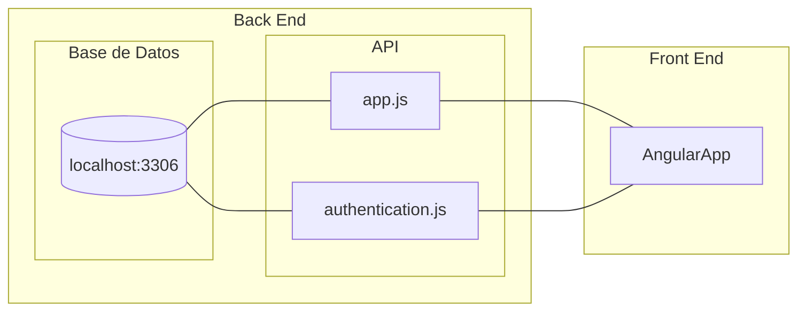
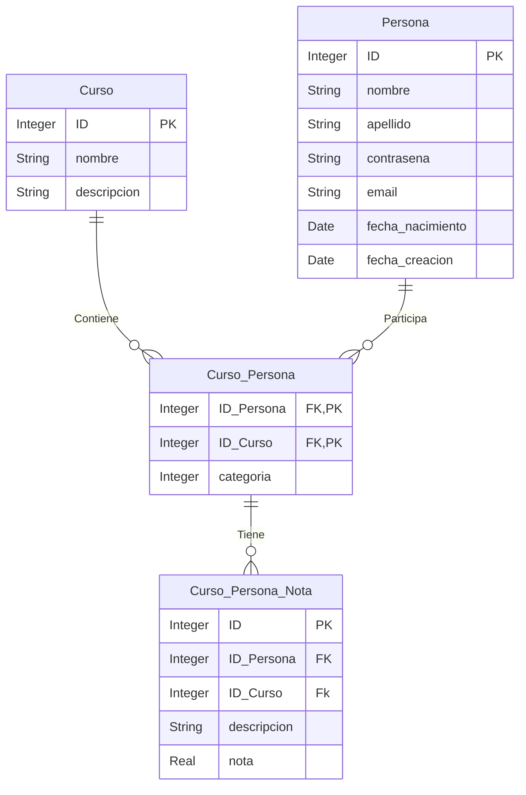

## Cosas Utiles
[TRELLO](https://trello.com/b/RQfTdn2D/tpdesarollodesoftware)

[FRONT END REPO](https://github.com/laucha54321/pagina-Universitaria-Front)

[BACK END REPO](https://github.com/laucha54321/tp-mysql-be)

[PROPUESTA](Propuesta.md)

# TP Desarollo BackEnd

Esta es una api que interactua con una base de datos SQL en laureanoliva.com:3306.

# Estructura
La idea es tener dos programas distintos en distintos puertos uno que se encargue de la validacion y otro que se encargue de los requests. Manejar las validaciones con [JSON web tokens](https://jwt.io) puede ser una buena idea.

El archivo de [app.js](app.js) seria el encargado de las requests y el de [authentication.js](authentication.js) el encargado de hacer las validaciones de los usuarios. Si utilizamos JWT entonces no tenemos que manejar sesiones en el backend solo guardar los tokens en el front y usarlos para acceder.

Los usuarios se almacenan en la base de datos en localhost:3306. Se almacenan usando [bcrypt](https://github.com/kelektiv/node.bcrypt.js), se hashean en total 11 veces.

Usamos un archivo .env para las conexiones, este archivo no existe en el repo por seguridad.



# Tablas en Base de datos



Los ID son AUTOINCREMNTALES.
Todos los nombres de las columnas empiezan con minuscula salvo los IDs. NO USAMOS MAYUSCULAS EN NOMBRES DE COLUMNAS a menos que esta sea para escribir ID o para la primer letra en las claves foraneas cuando hacemos referencia a la otra tabla. Por ejemplo ID_Persona

# REQUEST
Como se manejan los requests a la app.js.
## Cursos 
### GET (sin parametros)
Devuelve todos los cursos

### GET (con parametro en la URL id_curso)
Devuelve solo el curso con ese id_curso

### POST (con info en el BODY)
Crea un curso con un objeto que se le pasa en el request body como un JSON.
```JSON
{
    "nombre_curso":"Fisica 1",
    "descripcion":"Cinematica",
    "profesor_id":"2"
}
```

## Personas
### GET (sin parametros)
Devuelve todos las personas

### GET (con parametro en la URL id_personas)
Devuelve solo el curso con ese id_personas

### POST (con info en el BODY)
Crea un curso con un objeto que se le pasa en el request body como un JSON.
```JSON
{
    "nombre":"Cillian",
    "apellido":"Murphy",
    "contrasena":"122312312",
    "email":"cilianmuyrphy@yahoo.com",
    "telefono":"23414234",
    "fecha_nacimiento":"1976-05-25"
}
```


### Links utiles
[Best Practices for JWT authentication in Angular Apps](https://www.syncfusion.com/blogs/post/best-practices-for-jwt-authentication-in-angular-apps.aspx)


